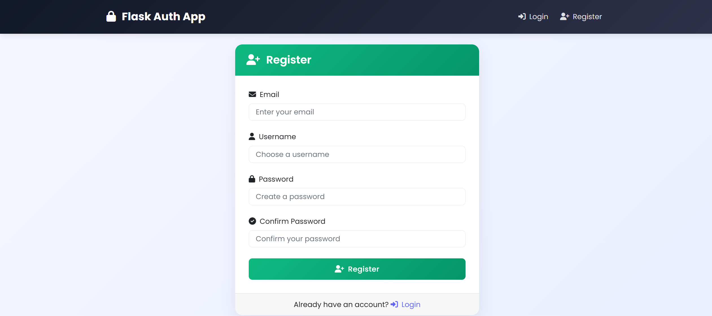
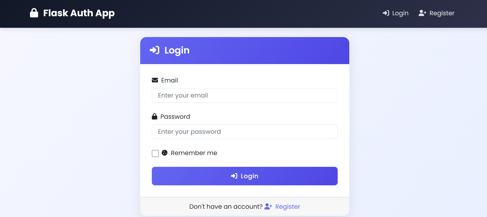
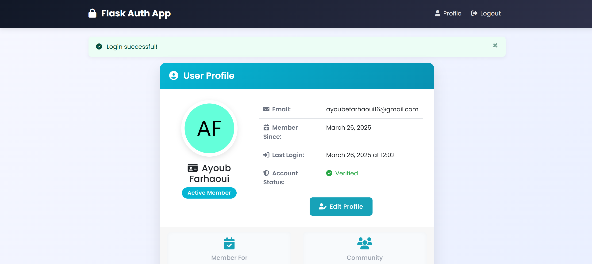
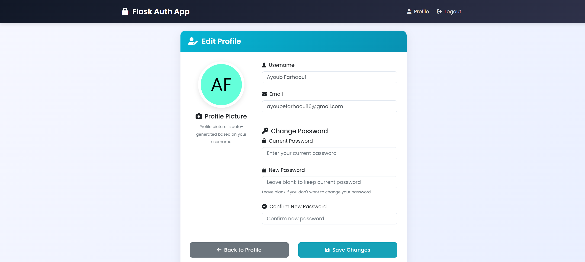

# Application d'Authentification Flask

Un système complet d'authentification utilisateur construit avec Flask, comprenant une inscription sécurisée, connexion, gestion des sessions et administration de profil.


## Table des Matières

- [Fonctionnalités](#fonctionnalités)
- [Captures d'écran](#captures-décran)
- [Structure du Projet](#structure-du-projet)
- [Installation](#installation)
- [Utilisation](#utilisation)
- [Détails Techniques](#détails-techniques)
- [Améliorations Futures](#améliorations-futures)

## Fonctionnalités

- **Authentification Utilisateur**
  - Inscription sécurisée avec validation d'email
  - Connexion avec hachage de mot de passe
  - Fonctionnalité "Se souvenir de moi"
  - Gestion des sessions
  - Déconnexion

- **Gestion de Profil**
  - Affichage des détails du profil utilisateur
  - Modification des informations utilisateur
  - Changement de mot de passe avec validation

- **Sécurité**
  - Hachage des mots de passe avec Werkzeug
  - Routes protégées avec décorateur login_required
  - Sécurité des sessions

- **Optimisation des Performances**
  - Gestion des sessions pour l'état utilisateur
  - Système de cache pour les données fréquemment consultées

## Captures d'écran

### Page d'Inscription

*Les utilisateurs peuvent créer un nouveau compte avec email, nom d'utilisateur et mot de passe*

### Page de Connexion

*Interface de connexion sécurisée avec option "se souvenir de moi"*

### Page de Profil

*Informations utilisateur affichées avec avatar généré automatiquement*

### Modification de Profil

*Interface pour mettre à jour les informations utilisateur et changer le mot de passe*

## Structure du Projet

Le projet suit une architecture modulaire pour une meilleure maintenabilité :

```
Mini_Projet_Flask/
├── app.py                  # Point d'entrée de l'application
├── config.py               # Paramètres de configuration
├── models/                 # Modèles de base de données
│   ├── __init__.py
│   └── user.py             # Définition du modèle utilisateur
├── controllers/            # Logique métier
│   ├── __init__.py
│   └── auth_controller.py  # Contrôleur d'authentification
├── views/                  # Routes et vues
│   ├── __init__.py
│   └── auth_views.py       # Routes d'authentification
├── templates/              # Templates HTML
│   ├── base.html           # Template de base avec éléments communs
│   ├── register.html       # Formulaire d'inscription
│   ├── login.html          # Formulaire de connexion
│   ├── profile.html        # Page de profil utilisateur
│   └── edit_profile.html   # Page d'édition de profil
├── static/                 # Ressources statiques
│   ├── css/                # Feuilles de style CSS
│   │   └── style.css       # Feuille de style principale
│   └── js/                 # Fichiers JavaScript
│       └── script.js       # Scripts principaux
└── utils/                  # Modules utilitaires
    ├── __init__.py
    ├── decorators.py       # Décorateurs personnalisés (ex: login_required)
    └── cache.py            # Fonctionnalité de cache
```

## Installation

Suivez ces étapes pour configurer l'application sur votre machine locale :

### Prérequis

- Python 3.7 ou supérieur
- pip (gestionnaire de paquets Python)
- Git (optionnel)

### Étape 1 : Cloner ou Télécharger le Dépôt

```bash
git clone https://github.com/farhaouiayoub/Mini_Projet_Flask_Ayoub-Farhaoui-IDAI.git
# OU télécharger et extraire le fichier ZIP
cd Mini_Projet_Flask_Ayoub-Farhaoui-IDAI
```

### Étape 2 : Créer et Activer un Environnement Virtuel (Optionnel mais Recommandé)

```bash
# Sur Windows
python -m venv venv
venv\Scripts\activate

# Sur macOS/Linux
python3 -m venv venv
source venv/bin/activate
```

### Étape 3 : Installer les Dépendances

```bash
pip install -r requirements.txt
```

### Étape 4 : Configurer l'Application

L'application est configurée pour utiliser SQLite par défaut, ce qui ne nécessite pas de configuration supplémentaire. Cependant, vous pouvez modifier `config.py` si vous devez changer des paramètres :

- `SECRET_KEY` : Pour la sécurité des sessions (changez-la en production)
- `DATABASE_URL` : Chaîne de connexion à la base de données
- `SESSION_TYPE` : Type de stockage de session
- `CACHE_TYPE` : Type de stockage de cache

### Étape 5 : Initialiser la Base de Données

```bash
# Démarrer le shell interactif Python
python
```

Dans le shell Python :

```python
from app import create_app
from models.user import db

app = create_app()
with app.app_context():
    db.create_all()
    print("Base de données initialisée avec succès !")
exit()
```

## Utilisation

### Lancer l'Application

```bash
python app.py
```

Par défaut, l'application sera disponible à l'adresse `http://127.0.0.1:5000/`

### Utilisation des Fonctionnalités Principales

1. **Inscription**
   - Naviguez vers `/register` ou cliquez sur le lien "S'inscrire" dans la barre de navigation
   - Remplissez votre email, nom d'utilisateur et mot de passe
   - Cliquez sur "S'inscrire" pour créer votre compte

   

2. **Connexion**
   - Naviguez vers `/login` ou cliquez sur le lien "Se connecter"
   - Entrez votre email et mot de passe
   - Cochez éventuellement "Se souvenir de moi"
   - Cliquez sur "Se connecter" pour accéder à votre compte

   

3. **Voir Votre Profil**
   - Après vous être connecté, cliquez sur "Profil" dans la barre de navigation
   - Consultez les détails de votre compte incluant email, nom d'utilisateur et date d'inscription

   

4. **Modifier Votre Profil**
   - Depuis votre page de profil, cliquez sur "Modifier le Profil"
   - Mettez à jour votre nom d'utilisateur ou email
   - Pour changer votre mot de passe, entrez votre mot de passe actuel puis le nouveau mot de passe deux fois
   - Cliquez sur "Enregistrer les modifications" pour mettre à jour vos informations

   

5. **Déconnexion**
   - Cliquez sur "Déconnexion" dans la barre de navigation pour terminer votre session

## Détails Techniques

### Gestion des Sessions

L'application utilise Flask-Session pour maintenir l'état de l'utilisateur entre les requêtes HTTP :

- **Stockage de Session** : Stockage basé sur le système de fichiers (configuré dans `config.py`)
- **Données de Session** : ID utilisateur et nom d'utilisateur stockés lors de la connexion
- **Durée de Vie de Session** : 30 minutes d'inactivité par défaut
- **Se Souvenir de Moi** : Prolonge la persistance de la session lorsqu'elle est cochée durant la connexion

Exemple de code de `auth_controller.py` :
```python
# Durant la connexion
session['user_id'] = user.id
session['username'] = user.username
session.permanent = remember  # Définit une session permanente si "se souvenir de moi" est coché
```

### Système de Cache

Un système de cache est implémenté pour améliorer les performances en réduisant les requêtes à la base de données :

- **Type de Cache** : Cache simple en mémoire
- **Délai d'Expiration du Cache** : 5 minutes (300 secondes) par défaut
- **Données Mises en Cache** : Informations utilisateur stockées avec l'ID utilisateur comme clé

Exemple de code de `auth_controller.py` :
```python
# Stockage des données utilisateur dans le cache
cache.set(f'user_{user.id}', user.to_dict(), timeout=300)

# Récupération des données utilisateur depuis le cache
cached_user = cache.get(f'user_{user_id}')
if cached_user:
    return cached_user
```

### Fonctionnalités de Sécurité

- **Hachage de Mot de Passe** : Utilise les fonctions de sécurité de Werkzeug pour hacher les mots de passe avant stockage
- **Routes Protégées** : Utilise un décorateur personnalisé `login_required` pour protéger les routes privées
- **Validation de Formulaire** : Validation côté client et serveur pour toutes les soumissions de formulaire
- **Indicateur de Force du Mot de Passe** : Retour visuel sur la force du mot de passe lors de l'inscription et du changement de mot de passe

## Améliorations Futures

Améliorations potentielles pour le projet :

- **Stockage de Session Avancé** : Remplacer les sessions basées sur le système de fichiers par Redis pour une meilleure scalabilité
- **Cache Distribué** : Implémenter une solution de cache distribué pour de meilleures performances
- **Sécurité Supplémentaire** : Ajouter la protection CSRF et l'authentification à deux facteurs
- **Récupération de Mot de Passe** : Implémenter une fonctionnalité de réinitialisation de mot de passe avec confirmation par email
- **Rôles Utilisateur** : Ajouter un contrôle d'accès basé sur les rôles pour différents types d'utilisateurs
- **Développement d'API** : Créer des API RESTful pour l'intégration d'applications mobiles

---

## Contribuer

Si vous souhaitez contribuer à ce projet, veuillez suivre ces étapes :

1. Forkez le dépôt
2. Créez une nouvelle branche (`git checkout -b feature/votre-fonctionnalité`)
3. Faites vos modifications
4. Committez vos changements (`git commit -m 'Ajout d'une fonctionnalité'`)
5. Poussez vers la branche (`git push origin feature/votre-fonctionnalité`)
6. Ouvrez une Pull Request

## Licence

Ce projet est sous licence MIT - voir le fichier LICENSE pour plus de détails.
